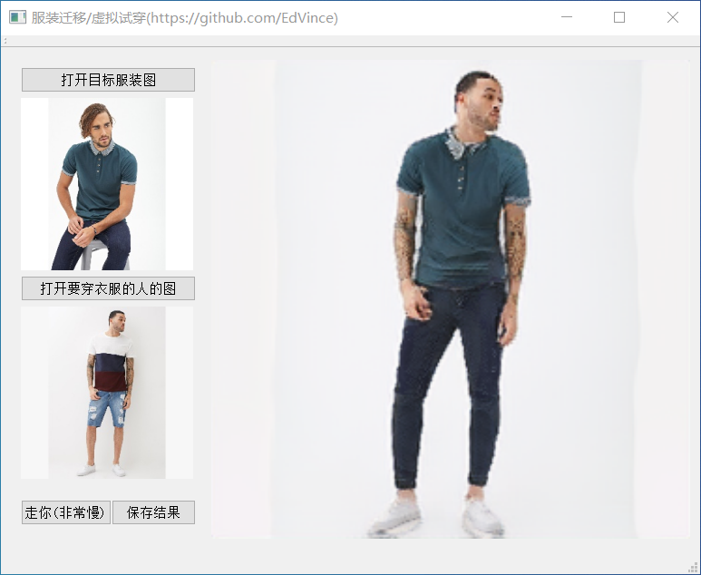
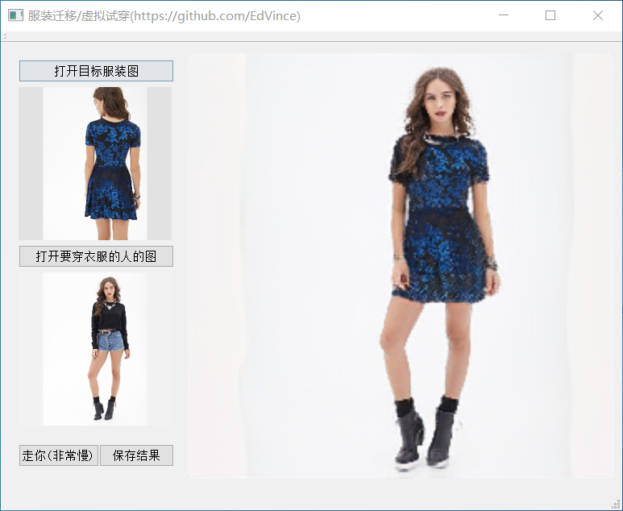

## ClothingMigration-NCNN

### What
1. [CT-Net](https://github.com/yf1019/CT-Net)：CVPR2021上的一个虚拟试穿/服装迁移的工作，该工程就是将CT-Net及其相关依赖网络移植到ncnn
2. 服装迁移：给定一个人的图A，与另一个人的图B，将A的衣服穿到B的身上

### PS
这个工作其实我个人计划做的一个系列，分三步：
1. 仿妆 —— [已完成](https://github.com/EdVince/PSGAN-NCNN)
2. 换衣服 —— [已完成](https://github.com/EdVince/ClothingTransfer-NCNN)，就是该工程
3. 换发型 —— 计划中

### Introduce
这个没啥好说，看图就完事了，先看换男装的：

再看女装：

程序流程分析，假定目标服装图A，目标穿衣人B：
1. 对A与B都应用OpenPose得到candidate和subset
2. 对A与B都应用JIP_LPPNet得到segment
3. 对B应用DensePose得到IUV
4. 对两个candidate、两个subset、两个segment、一个IUV以及图A、B应用CT-Net即可得到换装后的结果

### Resource
1. 上图的集成了所有功能的[exe程序]()，由于一共集成了4个模型，因此非常大，有1个多G，同时运行也很缓慢，大约要一分钟
2. 该github工程仅包含代码，实际运行调试需要模型，可以从上面的exe程序获取，再放到对应的位置就好了

### Content
将CVPR2021的服装迁移模型[CT-Net](https://github.com/yf1019/CT-Net)搬运至[NCNN](https://github.com/Tencent/ncnn)框架上
##### CT-Net依赖
1. 依赖[OpenPose](https://github.com/Hzzone/pytorch-openpose)的人体姿势——pytorch实现
2. 依赖[LIP_JPPNet](https://github.com/Engineering-Course/LIP_JPPNet)的的人体解析分割图——Tensorflow实现
3. 依赖[Densepose](https://github.com/facebookresearch/detectron2/tree/main/projects/DensePose)的人体IUV图——[Detectron2](https://github.com/facebookresearch/detectron2)实现
##### 待完成&已完成
- [x] OpenPose的ncnn&c++实现 —— OpenPose文件夹
- [x] LIP_JPPNet的ncnn&c++实现 —— LIP_JPPNet文件夹
- [x] Densepose的ncnn&c++实现 —— DensePose文件夹
- [x] CT-Net的ncnn&c++实现 —— CT-Net文件夹
- [x] 组合四个模型的ncnn&c++实现 —— Ensemble文件夹
- [x] QT GUI实现 —— QT文件夹

### Reference
1. [CT-Net](https://github.com/yf1019/CT-Net)
2. [OpenPose](https://github.com/Hzzone/pytorch-openpose)
3. [LIP_JPPNet](https://github.com/Engineering-Course/LIP_JPPNet)
4. [Densepose](https://github.com/facebookresearch/detectron2/tree/main/projects/DensePose)
5. [Detectron2](https://github.com/facebookresearch/detectron2)
6. [DenseSense](https://github.com/Axelwickm/DenseSense)
7. [ncnn](https://github.com/Tencent/ncnn)
8. [opencv-mobile](https://github.com/nihui/opencv-mobile)